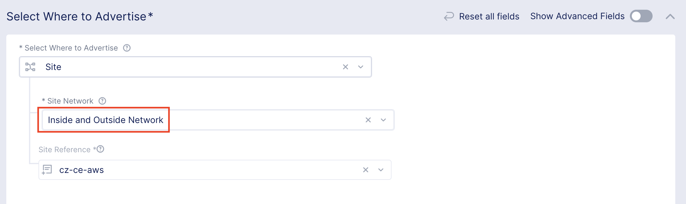

# How to integrate the F5 Web Application and API Protection service with Palo Alto VM-Series Firewalls in AWS

## Overview

The F5 Web Application and API Protection (WAAP) is a service offering provided under the F5 Distributed Cloud (F5XC). It is a L7 firewall that provides protection for your web application and API traffic.

The WAAP can be consumed in two ways, the 1st  being consuming it as a pure SaaS offering. With this option, all traffic will arrive at the F5XC's PoP's (we call it Regional Edge) where WAF screening and load balancing is performed, prior to those traffic being proxy-ed to your application servers.

With the 2nd option, in the context of an AWS deployment, traffic will hit an NLB and that NLB will then send traffic to a cluster of WAAP nodes. The NLB and WAAP nodes are automatically deployed by the F5XC management portal, but they are deployed in your AWS environemnt and this is referred to as a Customer Edge.

This solution talks about the 2nd mode of WAAP consumption (Customer Edge) being integrated with a Palo Alto next-gen firewall solution deployed in an AWS environment.

## Solution

The following diagram shows a high level architecture for this solution.

In the above diagram, there is the WAAP VPC and Security VPC. The WAAP VPC is a dedicated VPC to host all WAAP and supporting components and the Security VPC is dedicated to host all Palo VM-Series firewalls and their supporting elements including the Gateway Load Balancer.

The WAAP and Security VPC's are shared VPC's that provide services to spoke VPC's (e.g., SpokeVpc1), all of which are stitched together via the transit gateway.

This solution achieves the following objectives,

- Traffic coming in from the Internet, destined to a protected app gets inspected by Palo at L4 and optionally at L7 (with SSL decryption), followed by that traffic being inspected by WAAP at L7 and then load balanced (through WAAP) to backend servers (e.g., in a spoke VPC)

- Traffic originated from a spoke VPC, destined to an internal protected app gets inspected by Palo at L4 and optionally at L7 (with SSL decryption), followed by that traffic being inspected by WAAP at L7 and then load balanced (through WAAP) to backend servers (e.g., in a spoke VPC)

- Inter-spokeVpc traffic (e.g., traffic from VM1 to VM2 ) gets inspected by Palo at L4/L7

- Outbound Internet traffic from spoke VPC's gets inspected by Palo at L4/L7

## Architecture

The architecture auguments an existing documented solution being made available via a deployment guide from Palo, titled [VM-Series Integration with an AWS Gateway Load Balancer](https://docs.paloaltonetworks.com/vm-series/10-1/vm-series-deployment/set-up-the-vm-series-firewall-on-aws/vm-series-integration-with-gateway-load-balancer). **Please read this document to understand the original architecture**

The new architecture that this solution relies upon makes a number of major changes as listed below,

- Added a new VPC for WAAP that houses the WAAP cluster of three nodes (one per AZ), an IGW, an Internet NLB, an internal NLB as well as 3 x GWLB endpoints (one per AZ)

- Complete removal of IGW, GWLB endpoints and load balancers within spoke VPC's

- Significant changes in routing to ensure traffic is steered correctly

## Traffic traversal

Two types of traffic patterns are addressed by this solution.

- North-South bound

- East-West bound

The North-South bound refers to traffic originated from the Internet or from within a spoke VPC (e.g., VM1) and destined to an app (e.g., <https://app1.x>) proxy-ed through the WAAP.

In this case, you create an app with an associated FQDN in WAAP, have it published both on the external and internal interfaces of the WAAP cluster nodes and then map this FQDN as a CNAME to a NLB. For traffic coming in from the Internet, the FQDN is mapped to an Internet facing NLB; for internal traffic, map it to an internal NLB.

The Internet facing NLB load balances traffic to the WAAP cluster nodes' external interfaces, and the internal facing NLB load balances traffic to their internal interfaces.

When Internet traffic hits the app at <https://app1.x>, DNS resolves the FQDN to NLB's public IP's. Traffic to a public IP is then translated to an associated private IP that is owned by the NLB in a chosen AZ. As traffic for NLB destined to that private IP arrives at the AWS IGW, the associated ingress routing rule sends them to a GWLB endpoint that encapsulates the traffic first prior to delivering them to the Security VPC where traffic is load balanced to a Palo FW for decapsulation and screening. Once Palo is done, it encapsulates and passes the traffic back to the GWLB and the traffic eventually makes its way back to the GWLB endpoint at the WAAP VPC. The GWLB endpoint decapsulates and releases that traffic and routing rule finally sends it to the NLB.

What the above shows is that Internet traffic is screened by the Palo FW prior to it arriving on the NLB.

Once traffic arrives on the NLB, it gets load balanced to the WAAP cluster nodes at L4. WAAP screens the traffic at L7 prior to proxy it to the backend application servers in a spoke VPC.

For internal WAAP clients, when traffic exits out from the spoke VPC, it gets routed to the WAAP VPC, and upon entering the WAAP VPC, traffic is steered towards the GWLB endpoint and the rest of the traffic flow mirrors the previous example where traffic comes in from the Internet.

With East-West bound traffic, where traffic flows between spoke VPC's, routing rules steer them towards the GWLB endpoint in the Security VPC as they exit out from the source spoke VPC. Once traffic is screened by the Palo's they are then routed to the destination spoke VPC. This traffic pattern does not involve WAAP and purely rests with the Palo FW's.

Lastly, for spoke VPC originated Internet bound traffic, they are steered towards the GWLB endpoint in the Security VPC when traffic exits out from the spoke VPC, once Palo is done with screening, traffic is routed out via the NGW out to the Internet. This traffic pattern also does not involve WAAP.

## PoC Environment

I have built out a PoC environment that implementes this solution using the following detailed design diagram.

The PDF version is [here](./files/DetailedDesign.pdf).

## Terraform

The build leverages Terraform and the entire environment can be provisioned within 10 minutes. For the benefit of troubleshooting, the Terraform code is broken down with file names to indicate the subset of the environemnt that each file is building.

The Terraform code also uses third party modules to build the following list of components:

- WAAP site

- Internet and internal facing NLB

- GWLB and GWLB endpoints

## Remarks

- **Please read Palo's deployment guide to understand the original architecture**. [VM-Series Integration with an AWS Gateway Load Balancer](https://docs.paloaltonetworks.com/vm-series/10-1/vm-series-deployment/set-up-the-vm-series-firewall-on-aws/vm-series-integration-with-gateway-load-balancer) is a prereqsuite reading as this document serves as an augemention to that document.

- When you create an app in WAAP console in the form of a HTTP load balancer, you will need to advertise the app so it can be reached by your users. For this solution, advertise to the external and internal network of your site as shown below. This allows integration with the NLB's as all NLB needs to do is to forward traffic to the external or internal interfaces of the WAAP nodes.

- Three WAAP nodes are used to form a cluster in this solution, this is due to WAAP nodes are Kubernetes based with `etcd` datastore. `etcd` has a fault tolerence characteritic that's documented here <https://etcd.io/docs/v3.5/faq/#what-is-failure-tolerance>. In other words, three nodes provide a failure tolerance of one node. With a two-node Kubernetes cluster, there is no fault tolerance.

- With the three WAAP nodes, I have placed them in three AZ's, achiving best zonal redundency. However, as each node consumes a GWLB endpoint in the same AZ, three endpoints are created - one per AZ (i.e., az[123]-ep1 in design diagram). As each endpoint is mapped to an associated AZ, I have also used three Palo FW's with one per AZ for consistency.

- There are numerous route tables in this design as route tables are subnet specific in AWS. When traffic exits out from a spoke VPC (i.e., spokeVPC1), the route table associated with the VPC attachment (i.e., TGW-spokeVpc1-rt) dictates where traffic is sent to. When traffic enters a VPC, the route table associated with the subnets specified for VPC attachment is used to steer that ingress traffic.

- The Volterra Terraform module interfaces with the F5XC and creates a site there, and F5XC will in turn generate the provisioning code to deploy objects in AWS. This meant that your local Terraform state file does not track what's deployed in AWS regarding the various components comprising the WAAP site.

- When running the Terraform build, special care must be taken to ensure the sequence of the .tf files that get applied. This is due to a number of 3rd party modules being used to provision the various components and the way those modules are written does not allow Terraform to correctly figure out dependencies.

- The WAAP site is provisioned via the Volterra Terraform module and as such a slight modification must be made to subnet association in order to support this design. Specifically, the subnets of the internal interfaces for WAAP nodes need to be disassociated from the route table that the module creates. This allows for those subnets to be associated with a different route table.

- Due to the abovementioned change, you must apply the Terraform files in the following sequence.
    1. waapVpc-preWaapsiteCreation.tf
    2. waap-site.tf
    3. Disassociate internal subnets from route table
    4. Rest of .tf files

- One way to apply the .tf files in sequence is to move all the .tf files to the 'temp' directory first, only leave **waapVpc-preWaapsiteCreation.tf**, **prereq.tf**, **providers.tf** and variable files in the working directory. Run `terraform apply` to build out an existing VPC environemnt. Once building an existing VPC environment is completed, move **waap-site.tf** from the temp directory to the working directory and re-apply Terraform. Wait until it finishes, disassociate the internal networks (e.g., 10.1.10/24, 10.1.11/24 and 10.1.12/24) from the route table in AWS console manually. Once done, move the rest of the files from the temp directory to the working directory and run `terraform apply` again to build out the rest.

- For the purpose of testing, I have created an IGW for spokeVpc1 and spokeVpc2 in Terraform code, as this allows you to connect to VM1 and VM2 more easily. A specific route (within **spokeVpc1/2-main-rt**) is also made available for VM1 and VM2 so they can perform apt update and install Nginx as a testing server.

- For VM initiated Internet bound traffic, they exit out from GWLB endpoint2 in the Services VPC post inspection, with the next hop being a NAT Gateway. The Terraform code does not build out environment to support this type of traffic as it is covered in the Palo document referenced ealier on, and is left out as an exercise for the reader.

- Once the environment is built, further configuration is required on the Palo FW's to make it work. Specifically, zones are needed to create the security boundaries, as well as the GWLB endpoints be associated with the subinterfaces created on the Palo's. As an example, you can create two subinterfaces under the data interface, and have them associated with two different security zones. Each subinterface is then associated with a GWLB endpoint, which binds East-West bound traffic to one subinterface and North-South bound traffic to the other subinterface. This is documented under Palo's deployment guide section titled: [Manual Integration of the VM-Series with a Gateway Load Balancer](https://docs.paloaltonetworks.com/vm-series/10-1/vm-series-deployment/set-up-the-vm-series-firewall-on-aws/vm-series-integration-with-gateway-load-balancer/integrate-the-vm-series-with-an-aws-gateway-load-balancer/associate-a-vpc-endpoint-with-a-vm-series-interface)

## Conclusion

The integration of WAAP and Palo provides you with a stronger security posture, with each complementing the other giving you the best of both worlds.
