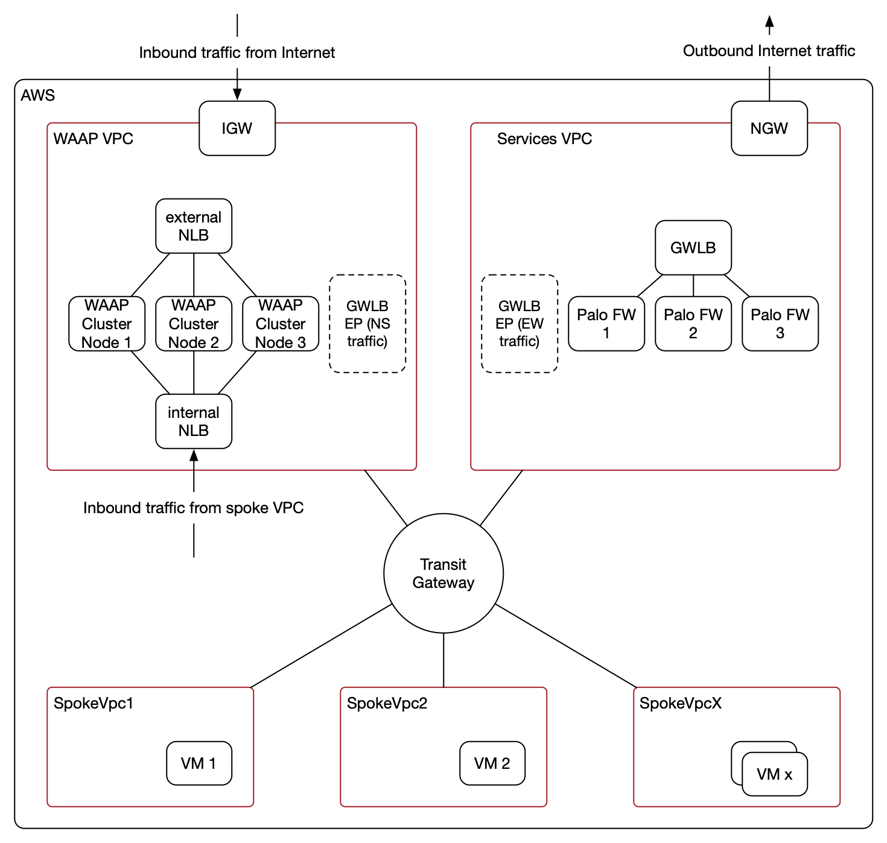
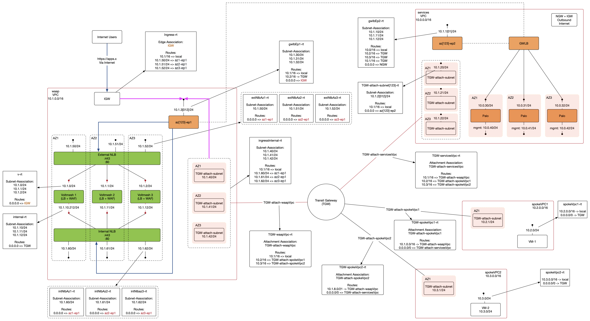

# How to integrate the F5 Web Application and API Protection service with Palo Alto VM-Series Firewalls within AWS

## Overview

The F5 Web Application and API Protection (WAAP) is a service offering provided under the F5 Distributed Cloud (F5XC). It is a L7 firewall that provides protection for your web application and API traffic.

The WAAP can be consumed in two ways, the 1st  being consuming it as a pure SaaS offering. With this option, all traffic will arrive at the F5XC's PoP's (we call it Regional Edge) where WAF screening and load balancing is performed, prior to those traffic being proxy-ed to your application servers.

With the 2nd option, in the context of an AWS deployment, traffic will hit an NLB and that NLB will then send traffic to a cluster of WAAP nodes. The NLB and WAAP nodes are automatically deployed by the F5XC management portal, but they are deployed in your AWS environemnt and this is referred to as a Customer Edge.

This solution talks about the 2nd mode of WAAP consumption (Customer Edge) being integrated with a Palo Alto next-gen firewall solution deployed within a shared AWS environment.

## Solution

The following diagram shows a high level architecture for this solution.

In the above diagram, there is the WAAP VPC and Security VPC. The WAAP VPC is a dedicated VPC to host all WAAP and supporting components and the Security VPC is dedicated to host all Palo VM-Series firewalls and their supporting elements including the Gateway Load Balancer.

The WAAP and Security VPC's are shared VPC's that provide services to spoke VPC's (e.g., SpokeVpc1), all of which are stitched together via the transit gateway.

This solution achieves the following objectives,

- Traffic coming in from the Internet, destined to a protected app gets inspected by Palo at L4 and optionally at L7 (with SSL decryption), followed by that traffic being inspected by WAAP at L7 and then load balanced (through WAAP) to backend servers (e.g., in a spoke VPC)

- Traffic originated from a spoke VPC, destined to an internal protected app gets inspected by Palo at L4 and optionally at L7 (with SSL decryption), followed by that traffic being inspected by WAAP at L7 and then load balanced (through WAAP) to backend servers (e.g., in a spoke VPC)

- Inter-spokeVpc traffic (e.g., traffic from VM1 to VM2 ) gets inspected by Palo at L4/L7

- Outbound Internet traffic from spoke VPC's gets inspected by Palo at L4/L7

